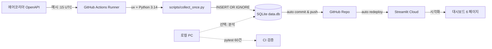

# 🌬️ 충북권 산업단지 대기질 SPC 모니터링 시스템

> **충북 5개 측정소(이차전지·반도체·화학·바이오 산단 + 거주지 베이스라인)의 대기질을
> 매시 자동 수집하여 통계적 공정관리(SPC)로 분석하는 무중단·무비용 운영 시스템.**

[](https://github.com/robinho0329/chungbuk-air-quality-monitor/actions)


🔗 **라이브 데모**: **https://chungbuk-air-quality-monitor-dfusndrdtukcwk9rog6wzt.streamlit.app/**
📂 **레포**: https://github.com/robinho0329/chungbuk-air-quality-monitor

> 클릭만 하시면 매시 자동 누적되는 충북 5개 측정소 대기질 데이터를
> 6페이지(홈/수집 모니터링/실시간 측정값/공정능력 분석/단지 비교/관리도)에서 확인할 수 있습니다.
> 컴퓨터를 꺼도 GitHub Actions가 매시 데이터를 추가하므로 계속 새로워집니다.

---

## 🎯 프로젝트 목적

QC/API 생산관리 직무에서 핵심 역량인 **SPC(통계적 공정관리)** + **6시그마 DMAIC** + **데이터 파이프라인 자동화**를 실데이터로 직접 구현해 입증하기 위한 시스템.

대기질을 제조 공정으로 빗댄 **메타포 프로젝트**:

| 제조 공정 (실제 직무) | 본 프로젝트 |
|---------------------|-----------|
| 공정 라인 N개 | 측정소 5곳 |
| 측정 지표 (불량률, 치수 등) | 6종 오염물질 (PM10/2.5, O3, NO2, SO2, CO) |
| 규격 한계 USL/LSL | 대기환경보전법 환경기준 |
| 시간당 샘플링 | 시간당 API 호출 |
| 공정능력지수 Cp/Cpk | (그대로) |
| 관리도 + Western Electric Rules | (그대로) |

---

## 🧭 6시그마 DMAIC 매핑

| 단계 | 활동 | 본 시스템 구현 |
|------|------|-------------|
| **D**efine | 문제 정의 | 산단 인근 대기질이 거주지보다 나쁜가? 어느 지표가 가장 문제인가? |
| **M**easure | 측정 시스템 구축 | `collectors/airkorea.py` + `flows/collect_flow.py` + GitHub Actions 매시 자동 수집 |
| **A**nalyze | 통계 분석 | `analysis/capability.py` Cp/Cpk + 단지 간 비교 (t-test/ANOVA 예정) |
| **I**mprove | 개선 권고 | Cpk 낮은 지표 식별 → 우선 관리 대상 도출 (분석 보고서) |
| **C**ontrol | 지속 모니터링 | Streamlit 대시보드 + Western Electric Rules 자동 알림 (예정) |

---

## 🏗️ 시스템 아키텍처



**핵심 특징**:
- ✅ **무중단**: GitHub 서버에서 매시 자동 실행 (사용자 PC 무관)
- ✅ **무비용**: GitHub Actions public repo 무제한 + Streamlit Cloud Community Tier
- ✅ **무누락**: INSERT OR IGNORE + UNIQUE(station, time)로 중복·재실행 안전
- ✅ **자가복구**: API 일시 장애 시 지수 백오프 재시도 3회
- ✅ **Self-healing**: 매 수집 실행이 직전 24h 갭을 감지·자동 백필 → GHA cron 드롭돼도 다음 성공 실행이 멱등 복구

> ⚠️ **수집 빈도 ≠ 데이터 해상도**: 외부 스케줄러가 시간당 3회(:15/:35/:55) 폴링하는 것은
> 에어코리아의 *가변 공개 지연*에 대응하는 **재시도(가용성)** 메커니즘일 뿐이다.
> 원본 측정 해상도는 **1시간 고정**이며, 같은 `data_time`은 `UNIQUE(station, data_time) + INSERT OR IGNORE`로
> **시각당 1건만** 저장된다(중복 누적 없음). 스키마는 측정시각(`data_time`)과 수집시각(`created_at`)을
> 분리 기록해 "원천 결측" vs "수집 누락"을 구분한다.

---

## 🌬️ 측정소 정의

| 측정소 | 단지 성격 | 위도, 경도 |
|--------|----------|----------|
| 오창읍 | 오창과학산업단지 (이차전지·반도체) | 36.713311, 127.420517 |
| 복대동 | 청주산업단지 (전자·화학) | 36.634423, 127.447045 |
| 오송읍 | 오송생명과학단지 (바이오·제약) | 36.631358, 127.329472 |
| 용암동 | 도시 베이스라인 (거주지) | 36.608818, 127.501293 |

---

## ⚙️ 기술 스택

| 영역 | 도구 | 선택 이유 |
|------|------|---------|
| 수집 | requests + 지수 백오프 재시도 | API 일시 장애 자가복구 |
| 저장 | SQLite + SQLModel | 단일 파일 → repo 영속화 용이 |
| 분석 | pandas + numpy | 표준 시계열 처리 |
| 통계 | Cp/Cpk (자체 구현) + scipy(예정) | 환경기준 기반 SPC |
| 시각화 | Streamlit + Plotly | 한국어 멀티페이지, 인터랙티브 |
| 자동화 | **GitHub Actions** + Prefect (로컬용) | 무비용 무중단 |
| 환경 | uv + Python 3.14 | 빠른 의존성 관리, lock 재현성 |
| 테스트 | pytest (60건 / all passing) | 변환·마스킹·DB 제약·SPC 계산 |
| 보안 | dotenv + 로그 마스킹 | API 키 노출 차단 |

---

## 🚀 빠른 시작

### 로컬 실행

```bash
# 1. 의존성 설치
uv sync

# 2. 환경 변수 설정
cp .env.example .env
# .env에 AIRKOREA_API_KEY 입력

# 3. 1회 수집
uv run python scripts/collect_once.py

# 4. 대시보드 실행
uv run streamlit run dashboard/app.py
```

### 테스트

```bash
uv run pytest -q   # 60건 통과
```

---

## 📚 상세 문서

| 문서 | 내용 |
|------|------|
| [`README_PROJECT.md`](README_PROJECT.md) | 프로젝트 배경·가설·Phase 계획 |
| [`docs/stations.md`](docs/stations.md) | 5개 측정소 정의 |
| [`docs/ANALYSIS_HYPOTHESES.md`](docs/ANALYSIS_HYPOTHESES.md) | 측정소 위치 기반 가설(H1~H3) + 검정 설계 |
| [`docs/DEVELOPMENT_PROPOSAL.md`](docs/DEVELOPMENT_PROPOSAL.md) | 에이전트 논의 종합 + AQM 리서치 기반 개발 로드맵 |
| [`docs/INTERVIEW_QA.md`](docs/INTERVIEW_QA.md) | 면접 예상 질문 & 답변 스크립트 (QC/API 직무) |
| [`docs/PHASE2_HANDOFF.md`](docs/PHASE2_HANDOFF.md) | Phase 진행 컨텍스트 |
| [`docs/GITHUB_ACTIONS_SETUP.md`](docs/GITHUB_ACTIONS_SETUP.md) | 자동 수집 설정 가이드 |
| [`docs/EXTERNAL_SCHEDULER_SETUP.md`](docs/EXTERNAL_SCHEDULER_SETUP.md) | 외부 cron(cron-job.org)으로 시간당 수집 보장 |
| [`docs/STREAMLIT_CLOUD_DEPLOY.md`](docs/STREAMLIT_CLOUD_DEPLOY.md) | 라이브 데모 배포 가이드 |
| [`docs/PREFECT_SETUP.md`](docs/PREFECT_SETUP.md) | (대안) 로컬 Prefect 운영 |

---

## 📊 진행 상태

- [x] **Phase 1**: 수집 + SQLite 저장 + 단위 테스트 38건
- [x] **Phase 2 (일부)**: Cp/Cpk 계산 + USL/LSL 환경기준 + 테스트 22건
- [x] **Phase 3 (일부)**: GitHub Actions 자동화, Streamlit 6페이지, Prefect flow
- [x] **Phase 2 (관리도)**: I-Chart/EWMA/CUSUM 관리도 + 이탈 탐지 (`control_chart.py`, 테스트 19건)
- [x] **Phase 2 (가설검정)**: Welch t-test/ANOVA + Cohen's d/η² + MD·Word 리포트 자동화 (`hypothesis_test.py`, 테스트 12건)
- [ ] **Phase 2 잔여**: Western Electric Rules, IsolationForest
- [ ] **Phase 3 잔여**: Streamlit Cloud 배포, Discord Webhook 알림
- [ ] **Phase 4** (선택): 기상청 API 결합, 풍향 회귀 분석
- [ ] **최종 산출물**: DMAIC 분석 보고서 (PDF)

---

## 📝 라이선스

MIT
